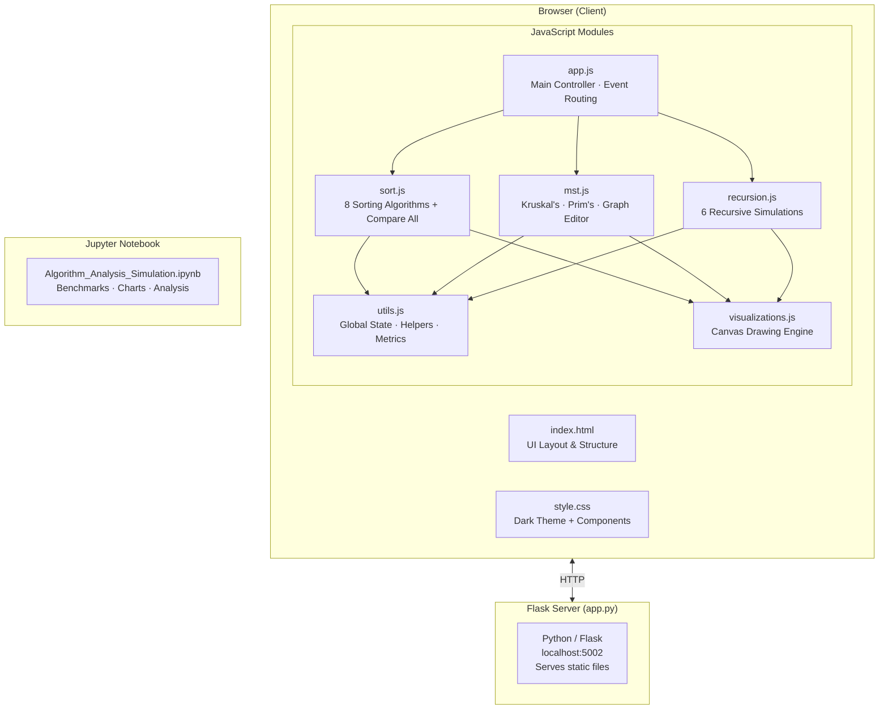
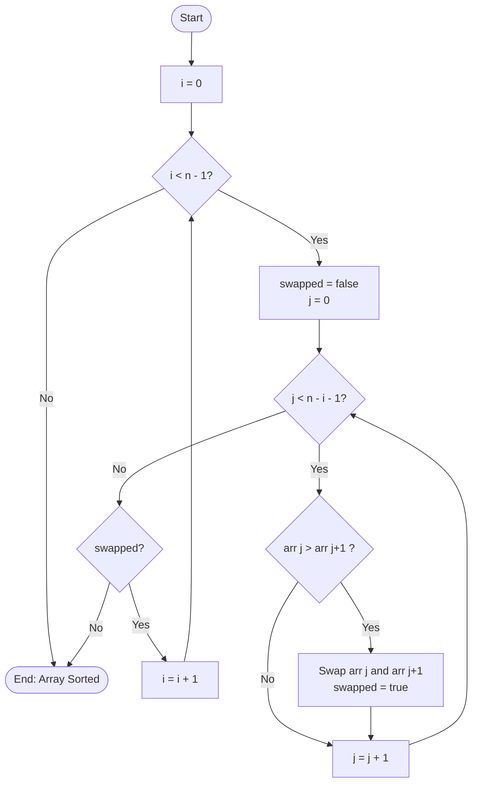
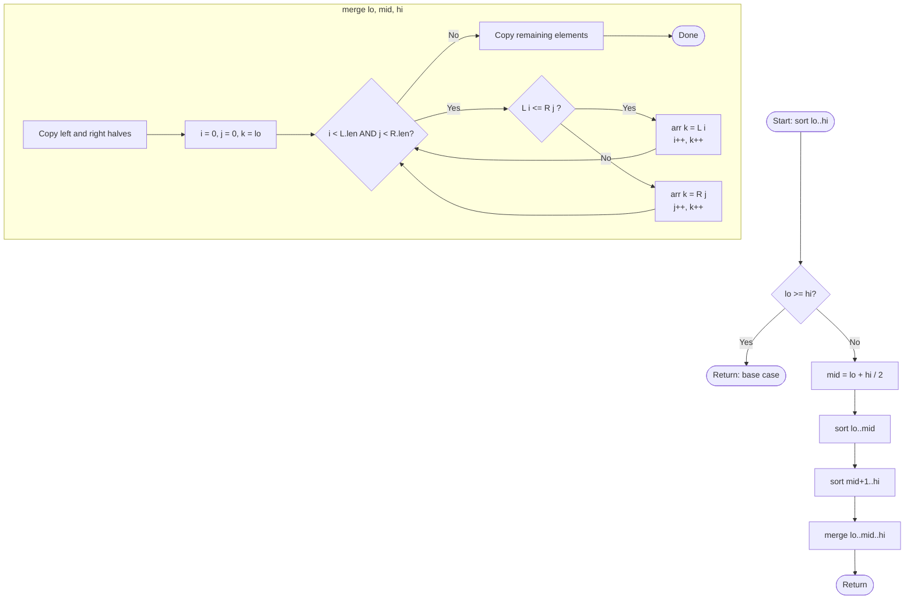
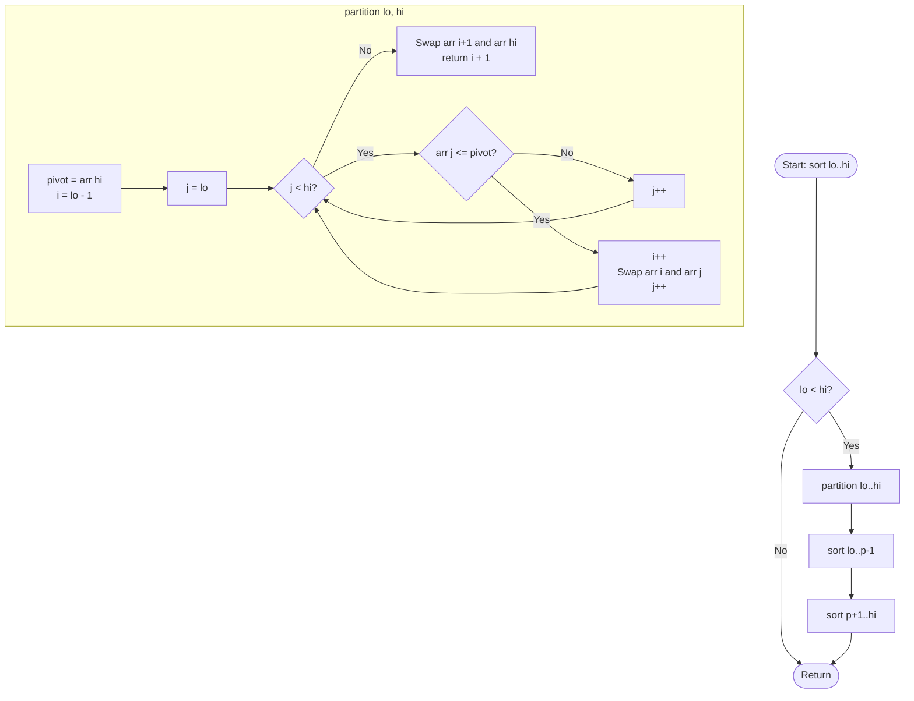
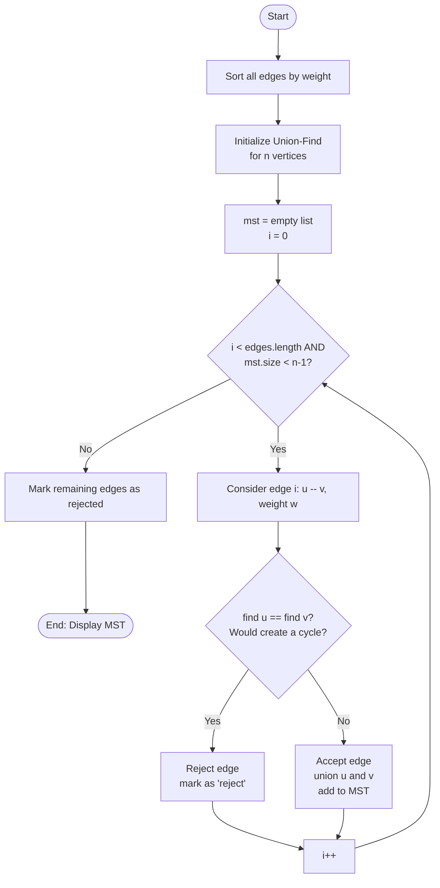
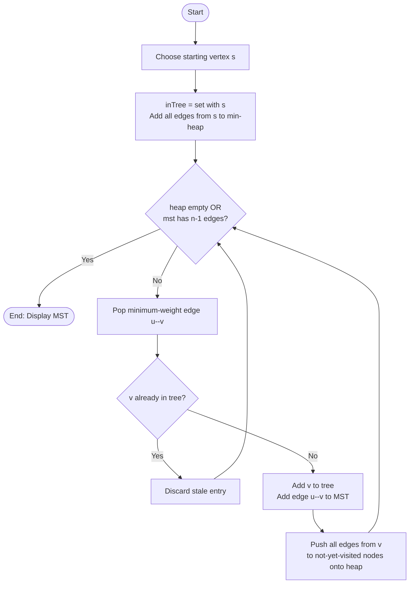
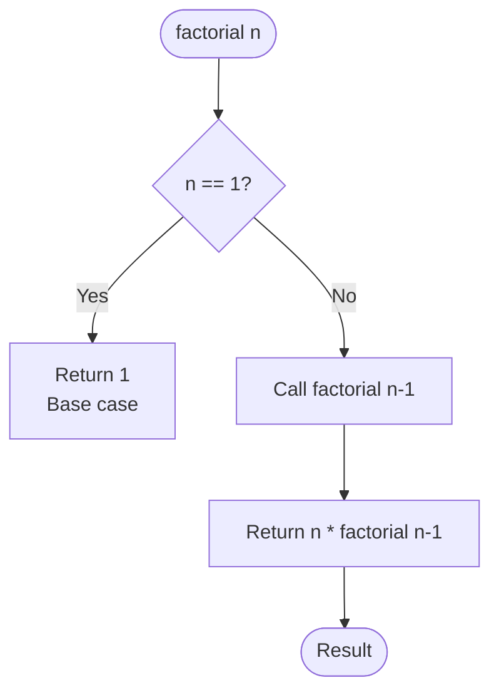
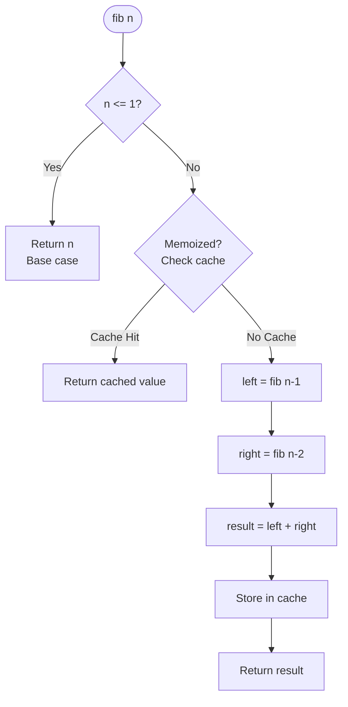
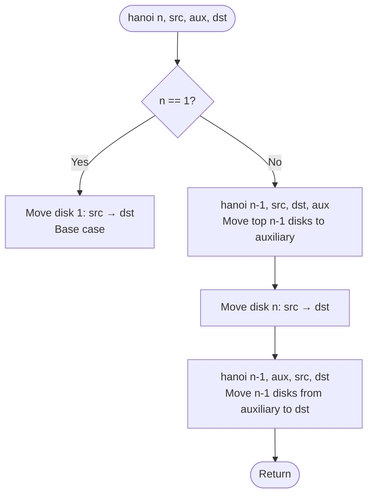

# Algorithm Analysis and Simulation Toolkit

**Final Project — Algorithms & Complexity | Term 2, SY 2025–2026**

An interactive web-based application that demonstrates, visualizes, and analyzes fundamental algorithms across three domains: sorting, minimum spanning trees, and recursive functions.

---

## Table of Contents

1. [How to Run](#how-to-run)
2. [System Architecture](#system-architecture)
3. [Module Structure](#module-structure)
4. [Part 1: Sorting Algorithms](#part-1-sorting-algorithms)
5. [Part 2: MST Algorithms](#part-2-mst-algorithms)
6. [Part 3: Recursive Functions](#part-3-recursive-functions)
7. [Algorithm Flowcharts](#algorithm-flowcharts)
8. [Complexity Reference](#complexity-reference)
9. [Sample Outputs](#sample-outputs)
10. [Bonus Features](#bonus-features)

---

## How to Run

**Requirements:** Python 3.x with Flask

```bash
# 1. Install Flask (if not already installed)
pip install flask

# 2. Navigate to the web app folder
cd finals_website

# 3. Start the server
python app.py

# 4. Open your browser and go to:
#    http://localhost:5002
```

The Jupyter notebook can be run independently:

```bash
cd algorithms_finals_notebook
jupyter notebook Algorithm_Analysis_Simulation.ipynb
```

---

## System Architecture



---

## Module Structure

| Module | File | Responsibility |
|--------|------|----------------|
| `main_program` | `app.js` | Section switching, event wiring, keyboard shortcuts |
| `sorting_module` | `sort.js` | All 8 sorting algorithms (animated + benchmark) |
| `graph_module` | `mst.js` | Graph editor, Kruskal's, Prim's, Union-Find |
| `recursion_module` | `recursion.js` | Factorial, Fibonacci, Hanoi, GCD, Binary Search |
| `visualizations` | `visualizations.js` | Bar, line, scatter, bubble, circular chart renderers |
| `utilities` | `utils.js` | Global State, metrics UI, logging, complexity table |
| `styles` | `style.css` | Full UI design system (CSS custom properties) |
| `server` | `app.py` | Flask dev server |

---

## Part 1: Sorting Algorithms

### Implemented Algorithms (8 total)

| Algorithm | Strategy | Best | Average | Worst | Space | Stable |
|-----------|----------|------|---------|-------|-------|--------|
| Bubble Sort | Adjacent swaps with early exit | O(n) | O(n²) | O(n²) | O(1) | Yes |
| Selection Sort | Find minimum, place at front | O(n²) | O(n²) | O(n²) | O(1) | No |
| Insertion Sort | Build sorted prefix | O(n) | O(n²) | O(n²) | O(1) | Yes |
| Merge Sort | Divide and conquer | O(n log n) | O(n log n) | O(n log n) | O(n) | Yes |
| Quick Sort | Partition around pivot | O(n log n) | O(n log n) | O(n²) | O(log n) | No |
| Random-Quick Sort | Quick Sort + random pivot | O(n log n) | O(n log n) | O(n²)* | O(log n) | No |
| Counting Sort | Frequency counting | O(n+k) | O(n+k) | O(n+k) | O(k) | Yes |
| Radix Sort | Digit-by-digit bucketing | O(nk) | O(nk) | O(nk) | O(n+k) | Yes |

\* Random-Quick worst case is O(n²) with vanishingly small probability.

### Features

- **Animated step-by-step visualization** on HTML5 Canvas
- **Multiple visualization styles**: Bar chart, Line graph, Scatter plot, Bubble chart, Pie/Circular
- **Configurable dataset**: size (5–300), type (random, sorted, reversed, nearly-sorted)
- **Real-time metrics**: comparisons, swaps, elapsed time, progress bar
- **Compare All mode**: benchmarks all 8 algorithms on the same dataset simultaneously

---

## Part 2: MST Algorithms

### Kruskal's Algorithm

Builds the MST by sorting all edges by weight, then greedily adding edges that don't create a cycle. Uses Union-Find (Disjoint Set Union) with path compression and union by rank for efficient cycle detection.

**Time Complexity:** O(E log E)
**Space Complexity:** O(V) for Union-Find

### Prim's Algorithm

Grows the MST from a chosen starting vertex. At each step, selects the minimum-weight edge crossing the frontier between the MST and the remaining graph. Uses a min-heap (priority queue).

**Time Complexity:** O(E log V) with binary heap
**Space Complexity:** O(V + E)

### Features

- **Interactive graph editor**: click to add nodes, click two nodes to add an edge
- **Random graph generator**: creates connected graphs with 3–12 nodes
- **Step-by-step animation**: edge consideration → accept/reject → MST formation
- **MST result panel**: lists selected edges and total cost
- Visual states: normal / active (considering) / MST (accepted) / rejected

---

## Part 3: Recursive Functions

### Implemented Functions (6 total)

| Function | Recurrence | Time | Space | Depth |
|----------|-----------|------|-------|-------|
| Factorial | T(n) = T(n-1) + O(1) | O(n) | O(n) | n |
| Fibonacci (Naive) | T(n) = T(n-1) + T(n-2) + O(1) | O(2ⁿ) | O(n) | n |
| Fibonacci (Memoized) | T(n) = T(n-1) + O(1) | O(n) | O(n) | n |
| Tower of Hanoi | T(n) = 2·T(n-1) + O(1) | O(2ⁿ) | O(n) | n |
| GCD (Euclidean) | T(a,b) = T(b, a mod b) | O(log min(a,b)) | O(log n) | log n |
| Binary Search | T(n) = T(n/2) + O(1) | O(log n) | O(log n) | log n |

### Features

- **Full call trace** with indentation showing recursion depth
- **Base case highlighting** (shown in orange)
- **Return values displayed** at each unwinding step
- **Cache hit indicators** for memoized Fibonacci
- **Configurable n** with safe upper bounds per function

---

## Algorithm Flowcharts

### Bubble Sort



### Merge Sort



### Quick Sort



### Kruskal's Algorithm



### Prim's Algorithm



### Factorial Recursion



### Fibonacci (Naive vs Memoized)



### Tower of Hanoi



---

## Complexity Reference

### Sorting

| Algorithm | Best | Average | Worst | Space | Stable |
|-----------|------|---------|-------|-------|--------|
| Bubble Sort | O(n) | O(n²) | O(n²) | O(1) | Yes |
| Selection Sort | O(n²) | O(n²) | O(n²) | O(1) | No |
| Insertion Sort | O(n) | O(n²) | O(n²) | O(1) | Yes |
| Merge Sort | O(n log n) | O(n log n) | O(n log n) | O(n) | Yes |
| Quick Sort | O(n log n) | O(n log n) | O(n²) | O(log n) | No |
| Random-Quick | O(n log n) | O(n log n) | O(n²)* | O(log n) | No |
| Counting Sort | O(n+k) | O(n+k) | O(n+k) | O(k) | Yes |
| Radix Sort | O(nk) | O(nk) | O(nk) | O(n+k) | Yes |

### Graph (MST)

| Algorithm | Time | Space |
|-----------|------|-------|
| Kruskal's | O(E log E) | O(V) |
| Prim's | O(E log V) | O(V+E) |

### Recursion

| Function | Time | Space | Max Depth |
|----------|------|-------|-----------|
| Factorial(n) | O(n) | O(n) | n |
| Fibonacci naive | O(2ⁿ) | O(n) | n |
| Fibonacci memo | O(n) | O(n) | n |
| Tower of Hanoi | O(2ⁿ) | O(n) | n |
| GCD(a,b) | O(log min(a,b)) | O(log n) | log n |
| Binary Search | O(log n) | O(log n) | log n |

---

## Sample Outputs

### Sorting Comparison (n = 100, random dataset)

```
Dataset Size: 100   Type: random

Algorithm         Time (ms)    Comparisons    Swaps
Radix Sort        0.021        100            100
Counting Sort     0.024        100            100
Merge Sort        0.076        544            183
Quick Sort        0.091        411            139
Random-Quick      0.097        428            144
Insertion Sort    0.312        2,453          2,453
Bubble Sort       0.587        4,950          2,601
Selection Sort    0.601        4,950          99
```

### MST Result (Kruskal's)

```
Edges selected for MST:
A -- C  (weight 2)
C -- D  (weight 3)
B -- C  (weight 4)
D -- E  (weight 5)
E -- F  (weight 7)
G -- F  (weight 8)

Total MST Cost = 29
```

### Recursion Trace (Factorial, n = 4)

```
factorial(4)
 -> 4 * factorial(3)
 -> 3 * factorial(2)
 -> 2 * factorial(1)
 -> base case: return 1
Result = 24
```

### Recursion Trace (Tower of Hanoi, n = 3)

```
Tower of Hanoi (3 disks, A → C)
  hanoi(3, A → C)
    Move disk 1 from A to C
    Move disk 2 from A to B
    Move disk 1 from C to B
  Move disk 3 from A to C
    Move disk 1 from B to A
    Move disk 2 from B to C
    Move disk 1 from A to C
Total moves: 7 = 2³ - 1 = 7
```

---

## Bonus Features

| Feature | Implementation |
|---------|---------------|
| GUI Application | Full browser-based interactive interface |
| Step-by-step animation | All three sections support pause/resume/step |
| Graphical visualization | 5 chart types: bar, line, scatter, bubble, circular |
| Performance charts | Jupyter notebook: benchmark charts + scalability curves |
| Compare All | Live GUI benchmark table comparing all 8 sorting algorithms |
| Interactive graph editor | Click-to-add nodes and edges for MST |
| Memoized Fibonacci | Side-by-side comparison of naive vs. memoized recursion |
| Large dataset testing | Sorting visualizer supports up to 300 elements |
| Keyboard shortcuts | Space/Enter = Run, R = Reset, G = Generate |

---

## Project Structure

```
algorithms-visualizer/
├── README.md                               ← This file
├── algorithms_finals_notebook/
│   ├── Algorithm_Analysis_Simulation.ipynb ← Jupyter analysis notebook
│   ├── sorting_benchmark.png               ← Generated performance chart
│   ├── sorting_scalability.png             ← Scalability analysis chart
│   ├── mst_visualization.png               ← Graph + MST overlay
│   ├── recursion_call_growth.png           ← Recursion call count chart
│   └── hanoi_growth.png                    ← Hanoi complexity curve
└── finals_website/
    ├── app.py                              ← Flask server (port 5002)
    ├── index.html                          ← Application layout
    ├── style.css                           ← UI design system
    ├── utils.js                            ← Shared state + helpers
    ├── visualizations.js                   ← Canvas rendering engine
    ├── sort.js                             ← Sorting algorithms module
    ├── mst.js                              ← Graph/MST module
    ├── recursion.js                        ← Recursion module
    └── app.js                              ← Main application controller
```
